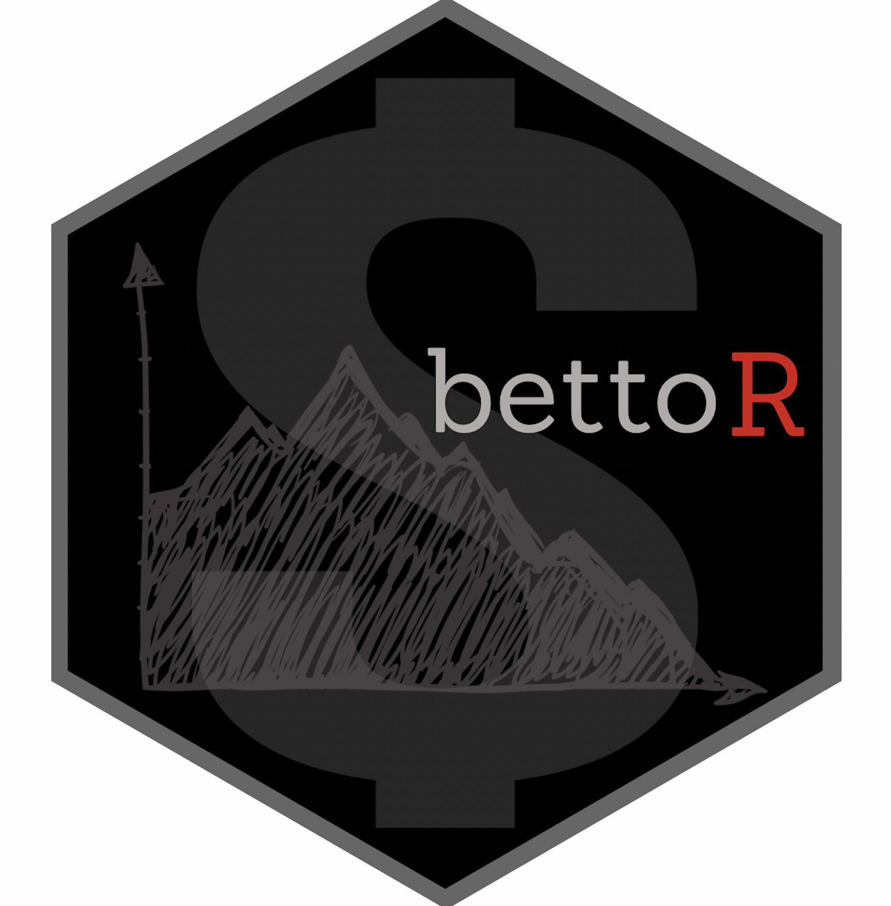

*bettoR*
================

# 

<!-- README.md is generated from README.Rmd. Please edit that file -->
<!-- badges: start -->

 [](https://github.com/papagorgio23/bettoR/actions)
[](https://travis-ci.com/github/papagorgio23/bettoR)
<!--[](https://img.shields.io/coveralls/github/papagorgio23/bettoR)
https://img.shields.io/codecov/c/github/papagorgio23/bettoR?style=plastic&token=4dcb468f-32ee-42a9-b610-92f9a6d0c896
[](https://codecov.io/github/ellessenne/rsimsum?branch=master) 
[](https://codecov.io/github/papagorgio23/bettoR?branch=master)-->
[](https://www.tidyverse.org/lifecycle/#experimental)
[](https://twitter.com/theFirmAISports)
<!-- badges: end -->

## Tools for Sports Betting

This package contains tools and functions to help sports bettors make
more money!

## Installation

You can install bettoR from
[GitHub](https://github.com/a-i-sports/bettoR) with:

``` r
# install.packages("devtools")
devtools::install_github("a-i-sports/bettoR")
```

## Examples

#### Implied Probability

Implied probabilities, or break-even win percentage, can easily be found
with this function. Here is an example with given odds of -350 (US
Odds), 180 (US Odds), 2.5 (Decimal Odds), 4.9 (Decimal Odds), 6-1
(Fractional Odds), 2/7 (Fractional Odds).

``` r
implied_prob(-350, type = "us")
```

    ## [1] 0.7777778

``` r
implied_prob(180, type = "us")
```

    ## [1] 0.3571429

``` r
implied_prob(2.5, type = "dec")
```

    ## [1] 0.4

``` r
implied_prob(4.9, type = "dec")
```

    ## [1] 0.2040816

``` r
implied_prob(6/1, type = "frac")
```

    ## [1] 0.1428571

``` r
implied_prob(2/7, type = "frac")
```

    ## [1] 0.7777778

#### Odds from Probabilities

Let’s say you believe a bet has a 75% chance to cover, what would the
price be? Using the implied odds function can give you the price based
on your probability.

``` r
implied_odds(0.75, type = "us")
```

    ## [1] -300

``` r
implied_odds(0.75, type = "frac")
```

    ## [1] 1/3

``` r
implied_odds(0.75, type = "dec")
```

    ## [1] 1.333333

``` r
implied_odds(0.75, type = "all")
```

    ##    Decimal American Fraction Implied.Probability
    ## 1 1.333333     -300      1/3                0.75

#### Converting Odds

Let’s say you want to convert the American Odds you see on the screen
(-175) to another type.

``` r
convert_odds(-175)
```

    ##    Decimal American Fraction Implied_Probability
    ## 1 1.571429     -175      4/7           0.6363636

#### Calculate Sportsbook’s hold

Betting into a market is difficult enough as is but some sportsbooks
skew the odds even more in their favor. (-110, -110) is the industry
standard. The hold, or vig/juice, for this bet can be found like this:

``` r
hold_calc(-110, -110)
```

    ## [1] 0.04545455

Some sportsbooks in newly legalized states are taking advantage of
bettors with lines (-125, -125)

``` r
hold_calc(-125, -125)
```

    ## [1] 0.1

The increase in juice for this is:

``` r
(hold_calc(-125, -125) - hold_calc(-110, -110)) / hold_calc(-110, -110)
```

    ## [1] 1.2

120% increase in price.

## Special Thanks

- To the entire [A.I. Sports](https://aisportsfirm.com/home/our-team/)
  team!
